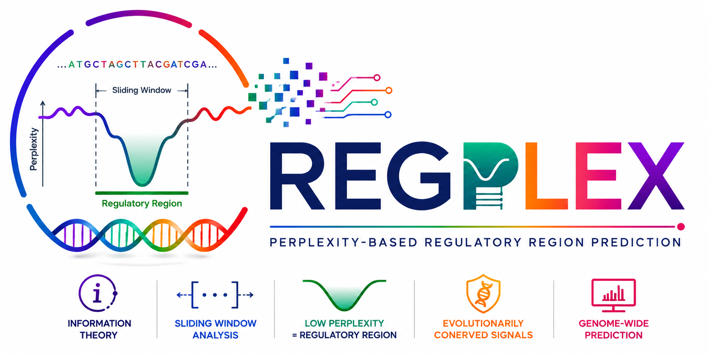

# REGPLEX

<p align="center">
  
</p>

<p align="center"><strong>Dinucleotide-centric Perplexity Valley Discovery for Regulatory Genomics</strong></p>

## Scientific Rationale (v12)

REGPLEX v12 is a **di-centric** redesign.

REGPLEX uses **Dinucleotide Perplexity** as its primary information-theoretic representation of DNA sequence organization.

Mononucleotide and Trinucleotide perplexities are retained as auxiliary evidence layers for interpretability and cross-species comparisons but do not participate in the primary detection engine.

### Why dinucleotide is primary

- Dinucleotide statistics directly encode nearest-neighbor stacking interactions.
- These interactions are strongly linked to local duplex stability.
- Promoter architecture and DNA structural organization are reflected in short-range pair dependencies.
- Empirical benchmarking showed no substantial independent discriminatory gain from Mono/Tri in core valley calling.

## Default Pipeline (scientifically recommended)

DNA
→ Dinucleotide Perplexity
→ Savitzky–Golay smoothing
→ Multi-scale LPC (25, 50, 100, 200, 400)
→ Di ConsensusLPC
→ Candidate valleys
→ Kadane refinement
→ Persistence filter (≥ 0.80)
→ Prominence filter
→ NMS
→ Merged domains
→ Final valleys

`MonoSupport` and `TriSupport` are reported as annotations, not detection signals.

## Operating Modes

- `promoter` (**default**): Dinucleotide signal + positional prior
- `genome`: Dinucleotide signal only (no positional prior)
- `ensemble` (**experimental**): Mono+Di+Tri exploratory consensus

### Positional prior parameters

- `CORE_WINDOW_UPSTREAM` (default: 500)
- `CORE_WINDOW_DOWNSTREAM` (default: 200)

Promoter prior keeps valleys within `[-500, +200]` relative to a reference point (default `0`).
Set either window to `None` to disable localization filtering.

## Algorithm Summary

1. Compute mono/di/tri perplexity once.
2. Smooth each profile with Savitzky–Golay.
3. Build multi-scale landscapes.
4. Build LPC profiles at each scale.
5. Build per-layer consensus tracks.
6. Build final ConsensusLPC according to mode (Di-only in promoter/genome).
7. Detect, refine, and filter valleys.
8. Rank using **Di-derived** metrics (`MeanLPC`, `Prominence`, `Persistence`, `ScaleSupport`, `Area`, `Length`, `Variance`).
9. Report support fields (`MonoSupport`, `DiSupport`, `TriSupport`, `OverallSupport`).

## Installation

```bash
git clone https://github.com/VRYella/PerCALL.git
cd PerCALL
pip install -r requirements.txt
```

## Quick Start

### Web interface

```bash
streamlit run app.py
```

### CLI

```bash
python regplex_core.py examples/ecoli.fasta --out regplex_v12_valleys.csv
python regplex_core.py examples/human_promoters.fasta --mode promoter --core-window-upstream 500 --core-window-downstream 200
python regplex_core.py examples/ecoli.fasta --mode genome --core-window-upstream none --core-window-downstream none
python regplex_core.py examples/ecoli.fasta --mode ensemble
```

## Outputs

Core fields include coordinates, `MeanLPC`, `Prominence`, `Persistence`, `ScaleSupport`, `MonoSupport`, `DiSupport`, `TriSupport`, `OverallSupport`, and `ValleyScore`.

Formats: CSV, Excel, BED, GFF/GFF3, FASTA, JSON.

## Notebook

- `REGPLEX_Local.ipynb` includes the local v12 walkthrough and rationale for dinucleotide-primary detection.

## License

MIT
